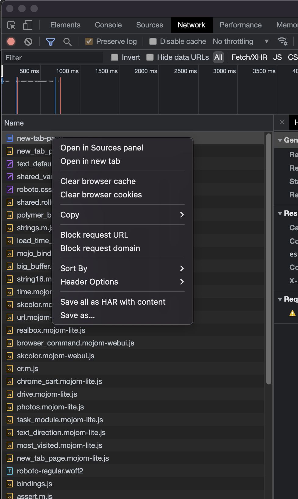

# tools
## pb_c2p
get the curl code in Clipboard and translate it to python requests
### install
1. install python3
2. install node
3. `npm install curlconverter -g`
4. add the path to `zshrc` or `bashrc`
### usage
1. open chrome and open inspect
2. goto your website
3. select the network in inspect
4. right click the  request
    
5. select the `copy`
6. select the `Copy as cURL`
7. open the terminal
8. type `pb_c2q`
9. then the python_code in Clipboard，`super + v`
### why
1. when the curl code has both `'` and `"`,the curlconverter will report error
    ```
    curl 'https://pss.bdstatic.com/r/www/cache/static/protocol/https/voice/js/voice_1094c9d.js' \
    -H 'authority: pss.bdstatic.com' \
    -H 'sec-ch-ua: " Not A;Brand";v="99", "Chromium";v="96", "Google Chrome";v="96"' \
    -H 'sec-ch-ua-mobile: ?0' \
    -H 'user-agent: Mozilla/5.0 (Macintosh; Intel Mac OS X 10_15_7) AppleWebKit/537.36 (KHTML, like Gecko) Chrome/96.0.4664.110 Safari/537.36' \
    -H 'sec-ch-ua-platform: "macOS"' \
    -H 'accept: */*' \
    -H 'sec-fetch-site: cross-site' \
    -H 'sec-fetch-mode: no-cors' \
    -H 'sec-fetch-dest: script' \
    -H 'referer: https://www.baidu.com/' \
    -H 'accept-language: zh-CN,zh;q=0.9' \
    --compressed
    ```
2. when i use stdin，and a line is too long，the stdin will no responding，unless i use ctrl + c
